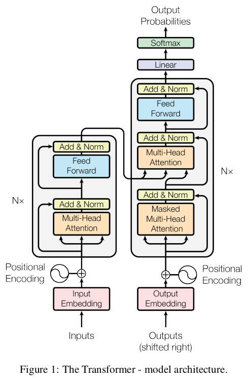

Arxiv link: https://arxiv.org/abs/1706.03762

One of the very first research papers I read and one that I enjoyed understanding. I wrote this blog with beginners in the field of AI/ML in mind, aiming to help them understand the paper more clearly and efficiently.

# The Arrival of Transformers

In 2017, a paper that is incredibly monumental in the field of deep learning was released, **'Attention Is All You Need'**. 

This paper introduced the Transformer architecture utilising **only the concept of attention mechanisms** while getting rid of any recurrences or convolutions to deal with sequential data. This architecture is the foundation behind almost every modern AI models today including GPT, BERT, ViT etc.

When you look at an entire language, it comprises of letters, words, sentences and paragraphs. What gives a language meaning, is the order in which these elements are written so as to allow the reader to understand them. If these elements were randomly shuffled, they wouldn't make any sense at all. 

Now, researchers wanted to use natural language as an input for tasks such as machine translation, text summarization etc. Traditional "vanilla" neural networks required **fixed size inputs and outputs** but this made it difficult to take language as an input as it is of variable length.

For example,

> "Elementary, my dear Watson."

and

> "Watson, the answer is quite apparent if you tie in all the clues to deduce the probable conclusion."

Both of these sentences are of different lengths but they somewhat imply the same intention.

Let us take an example of **English to French Translation** Task,

> "It's over, Anakin. I have the high ground." ~ English

> "C'est fini, Anakin. J'ai l'avantage du terrain." ~ French

This is an example of translation by Google Translate that relies on **GNMT** (Google Neural Machine Translation) utilizing the concept of attention.

What it does is understand the context of the English sentence and translate into French which would make sense for the french native readers without it feeling awkward.

If it was a rigid system and translated every English word directly to French then the French sentence would have somewhat looked like this.

> "C'est sur, Anakin. Je avoir le haut sol."

Here, the word 'sur' refers to the positional meaning of the word 'over' meaning upon and on, thereforce the inclusion of context of the entire sentence is quite important.

Before Transformers, sequential tasks like machine translation were **dominated by RNNs and convolution-based architectures**. RNNs processed language sequentially maintaining a **hidden state** that carried information from previous tokens forward through the sequence. 

Now, the major problem here was the **severe limitation of parallelization** since every token depended on the previous hidden state. RNNs couldn't process these tokens in parallel. They also **struggled with long-range dependencies** since the information passes through the hidden state and for longer range, the old information would gradually weaken.

Architectures like **LSTMs** (Long Short Term Memory) and **GRUs** (Gated Recurrent Units) improved this process by reducing memory loss across longer contexts but the computation still remained fundamentally sequential.

Then came convolution-based models such as ConvS2S and ByteNet that later attempted to improve parallelization by processing tokens through convolutional layers instead of strict recurrence but they still **relied heavily on local neighborhoods** and required multiple layers for distant information to propagate effectively.

What Transformers did was that they corrected multiple major problems that earlier architectures were facing in sequential tasks i.e Transformers made use of **efficient GPU parallelization** and dealing with long range context in a more effective manner. They removed the need for locality aspect of convolution based models as well.

One thing to note is that, 'Attention is All You Need' did **not** invent the attention mechanism itself. It was introduced in the paper - **[Neural Machine Translation by Jointly Learning to Align and Translate](https://arxiv.org/abs/1409.0473)**. 
Before the Transformer paper, attention mechanisms were widely used alongside recurrent architectures. What this paper proposed was an architecture built entirely around self-attention completely removing both recurrent and convolutional operations.

## What the hell is Attention?

Attention tries to answer one simple question. 

> To understand this word, what other words in the sentence are important?

Let us take this sentence.

> "The quick brown fox jumps over the lazy dog."

Now suppose the model is trying to understand the word **'jumps'**. To understand the context around this word, not every word is relevant in the sentence.

The word **'fox'** is extremely important because it tells us who is performing the action.

The word **'over'** is also important because it describes the relationship of the action.

The phrase **'lazy dog'** tells us what the fox is jumping over.

However, words like **'the'** may not contribute as strongly to the actual semantic understanding of the action itself.

This is exactly what attention does. Instead of treating every word equally, the model dynamically decides which words **matter more or less** and how different words are related to each other.

What I just described to you is self attention and this is the reason the Transformer can model long-range dependencies extremely effectively. A word does not need to wait for information to travel sequentially through hidden states like in RNNs. It can directly access relevant information from anywhere in the sentence immediately.

However, there is a **big issue** with single self attention. When attention gathers information from multiple words, it essentially combines contextual signals together into one representation. The problem is that different kinds of relationships may start **getting blended or averaged together**.

This is exactly why the Transformer introduced **Multi-Head Attention**. Instead of performing one single attention operation, the model performs several attention operations in parallel. Each attention head learns to **focus on different kinds of relationships**.

Of course, attention is **not perfect** either. Since every token in the sequence interacts with every other token, the amount of computation grows quadratically with the sequence length i.e. $O(n^2)$. This becomes extremely expensive for longer contexts because the model now has to compute relationships between every possible pair of words.

As modern LLMs started dealing with huge contexts, this gradually became one of the **biggest bottlenecks of Transformers**. This later led to several optimizations such as FlashAttention, sparse attention mechanisms and even alternative architectures like Mamba and State Space Models. However despite all these improvements and alternatives, the fundamental Transformer idea still remains the backbone of modern AI systems.

# Understanding the Architecture

The Transformer still follows the **classical sequence-to-sequence framework** that earlier neural machine translation systems used. There is still an encoder and a decoder. Only the reliance on recurrence and convolution is removed.

The architecture is divided into two halves. The left side is the encoder stack which receives the input sequence and converts it into contextual vector representations and the right side is the decoder stack that uses those contextual representations to generate the output sequence token-by-token.

One important thing to understand here is that the Transformer **did not remove sequential generation** itself. During training, tokens can be processed in parallel because attention allows simultaneous interaction between all positions. But during inference, the decoder still generates outputs one step at a time because the next token depends on previously generated tokens. So Transformers **parallelized the training aspect**, but **autoregressive generation still remains sequential**.

## Encoder

Input enters into the encoder stack. The encoder first converts every token into embeddings. These embeddings are **dense vector representations of words**. However, embeddings alone are insufficient because the Transformer contains neither recurrence nor convolutions so they can't comprehend the concept of sequence by themselves. Unlike RNNs, there is no hidden state moving through time. Unlike CNNs, there is no local sliding window. This means the architecture itself has **no inherent understanding of sequence order**.

To solve this, **positional encodings** are added to the embeddings. These encodings inject information about token positions directly into the representations. The paper uses **sinusoidal positional encodings** using sine and cosine functions of different frequencies. Some of other methods of positional encoding are RoPE (Rotary Positional Embeddings), ALiBi (Attention with Linear Biases) etc.

The important intuition is that the model must be able to see that the given sentences are different.

> "The gun is pointed at my forehead."

and

> "The forehead is pointed at my gun."

Both contain identical words but entirely different meanings because of order. Positional encodings allow the Transformer to incorporate this ordering information despite having no recurrence.

The encoder itself consists of a stack of **6 identical layers**. 'Identical' here refers only to the structure **not the learned parameters**. Each layer learns different transformations even though the architecture is repeated.

Each encoder layer mainly contains **two sub-layers**. The first is **Multi-Head Self-Attention** and the second is a **Position-wise Feed Forward Network**.

The self-attention layer is where tokens exchange information with one another.

Suppose we take this example. 

> 'My laptop crashed because it overheated.'

To properly represent the token 'it', the model must understand that **'it' refers to 'laptop'**. Earlier RNNs attempted to preserve such relationships through hidden states propagated sequentially across time. Transformers instead create direct interactions between tokens through attention.

Every token generates three vectors - **Query, Key and Value**.

If we look at these vectors intuitively,

> Query asks "What information should I be looking for?"

> Key asks "What kind of information do I contain?"

> Value represents "What information should I contribute if selected?"

The model compares queries against keys to determine relevance. Tokens with stronger similarity receive **higher attention weights and contribute more** strongly through their value vectors.

Mathematically, the paper defines attention as:

**$$\mathrm{Attention}(Q,K,V)=\mathrm{softmax}\left(\frac{QK^T}{\sqrt{d_k}}\right)V$$**

This equation is one of the central equations behind modern deep learning systems.

The first operation **$QK^T$** computes similarities between queries and keys. Larger values indicate stronger relevance.

However as dimensionality grows, these dot products become very large statistically.

If **$q \cdot k = \sum_{i=1}^{d_k} q_i k_i$**

then the variance of the dot product grows approximately proportionally to **$d_k$**

which means the standard deviation grows as **$\sqrt{d_k}$**

Large values push the softmax function into extremely saturated regions, producing tiny gradients and unstable learning. The scaling factor **$\frac{1}{\sqrt{d_k}}$** prevents this instability.

After scaling, softmax converts the similarities into probability-like attention weights. These weights determine how strongly each token contributes to the updated representation.

What makes the Transformer especially powerful is Multi-Head Attention. Instead of learning a single attention pattern, the model learns multiple attention patterns simultaneously.

With a single attention mechanism, all relationships get **compressed into one representation space**. Multiple heads allow the model to preserve multiple perspectives simultaneously.

The paper uses **8 attention heads** with model dimension to be **512** meaning each head operates on **64 dimensional projections**.

After tokens exchange information through attention, each token is processed independently through the **Feed Forward Network**.

Attention mainly mixes information between tokens. The feed-forward network performs computation on each token individually.

The feed-forward layer is defined as **$\mathrm{FFN}(x)=\max(0,xW_1+b_1)W_2+b_2$**.

**Why is this necessary?**

Because attention alone is mostly a weighted averaging mechanism. Without nonlinear transformations, the model would have limited expressive capability. The feed-forward network introduces nonlinear feature transformation after contextual information has already been exchanged.

Another critical component throughout the architecture is the residual connection followed by layer normalization, **$\mathrm{LayerNorm}(x + \mathrm{Sublayer}(x))$**

Residual connections solve a major optimization problem in deep neural networks.

Instead of forcing every layer to completely replace previous representations, the layer learns **a correction or refinement** over the existing representation. This preserves information flow and stabilizes gradient propagation across deep stacks.

Self-attention dynamically mixes information from many tokens, which can cause unstable activation magnitudes. This is handled by **layer normalization that stabilizes the activations**.

## Decoder

The decoder stack on the right side of the architecture is mostly similar to the encoder, however it introduces two crucial modifications.

First, the decoder contains **Masked Multi-Head Self-Attention**.

The masking is necessary because the decoder **generates tokens autoregressively**. When predicting the next token, the model must not access future tokens. Otherwise training would leak future information. The causal mask ensures that while predicting the current word, the model cannot already see any of the future words. Illegal future connections are masked out before softmax computation by assigning them **negative infinity**.

Suppose during training, the target sentence is the following. 

> 'I love transformers'.

If we want to predict the word **'transformers'**, the decoder input will be **'I love'** (the correct ground truth words) even if it might have predicted incorrectly. This mechanism is called **teacher forcing** which leads to faster and stable learning since errors do not accumulate, however we can't use this technique during inference, so it does create an **exposure bias.**

The second major addition is **Encoder-Decoder Attention.**

This layer allows decoder tokens to attend directly to encoder outputs. While generating French words, the decoder can dynamically focus on the most relevant English words.

This solved one of the biggest weaknesses of early encoder-decoder systems. Earlier sequence models attempted to compress the entire input sentence into one fixed vector representation. As sentence lengths increased, there were huge information bottlenecks.

Attention removes this compression bottleneck entirely. The decoder can continuously access all encoder representations dynamically throughout generation.

Finally, after passing through decoder layers, the representations go through a linear projection followed by softmax to generate probabilities over the vocabulary. The token with the highest probability is selected as the next generated token.

**Voila, we have our output!**

# Summary of Training and Results + Conclusion

Here are some of the numbers and terms summarized to the training and results in the paper. The efficiency of the model in this paper was superb compared to the earlier systems.

The paper trained the model on the **WMT 2014 English-German and English-French machine translation datasets** using **byte-pair encoded token vocabularies**. (byte-pair encoded token vocabulary here refers to converting raw text into subword reusable units, kind of an in between of word-level and character-level tokenization).

Sentences were grouped by similar sequence lengths to improve computational efficiency during batching. (to minimise the padding required since it affects computational efficiency)

The base Transformer model was trained on **8 NVIDIA P100 GPUs** for about 12 hours while the larger **"Transformer Big"** model was trained for roughly 3.5 days.

For optimization, the paper used the **Adam optimizer with a custom learning rate schedule** instead of a fixed learning rate. The learning rate first increases gradually during an initial warmup phase and later decreases proportionally to the inverse square root of the training step number.

This warmup strategy was a great choice because Transformers are often unstable during early training due to its inital parameters being randomly initialized. The optimization must be eased as the learning rate increases. The paper also used regularization techniques such as dropout and label smoothing to improve generalization and prevent overconfidence in predictions.

In terms of results, on the **WMT 2014 English-to-German translation task** the Transformer achieved a **BLEU score of 28.4** outperforming previous state-of-the-art systems including recurrent and convolutional ensembles. On the English-to-French task, it achieved a **BLEU score of 41.8** while requiring only a fraction of the training cost compared to earlier architectures.

BLEU stands for **Bilingual Evaluation Understudy** is a metric used to evaluate machine translation quality by comparing generated translations against human reference translations. Higher BLEU scores generally indicate better translation performance.

The paper also performed ablation studies to understand which architectural components mattered most. They experimented with varying the number of attention heads, attention dimensions, model sizes, dropout values, and positional encoding methods. The experiments showed that **multi-head attention substantially improved performance** compared to single-head attention, **larger models consistently performed better**, and **dropout was critical** for avoiding overfitting.

Though, **too many heads led to a drop in quality**. Interestingly, learned positional embeddings and sinusoidal positional encodings produced nearly identical results. This can be due to the **minimal need of positional information** for the transformer.

Beyond translation, the paper also tested the Transformer on English constituency parsing tasks. Even without extensive task-specific tuning, the model achieved highly competitive parsing performance demonstrating that the architecture generalized beyond machine translation alone.

The most important conclusion of the paper was that recurrence was not fundamentally necessary for sequence understanding. Self-attention alone was sufficient to model long-range dependencies effectively while enabling massive parallelization. That idea eventually became the foundation behind nearly all modern large-scale AI models.